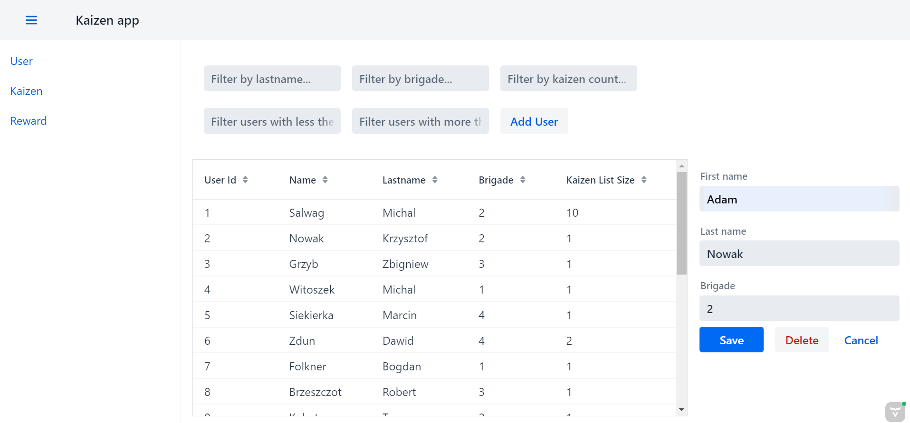
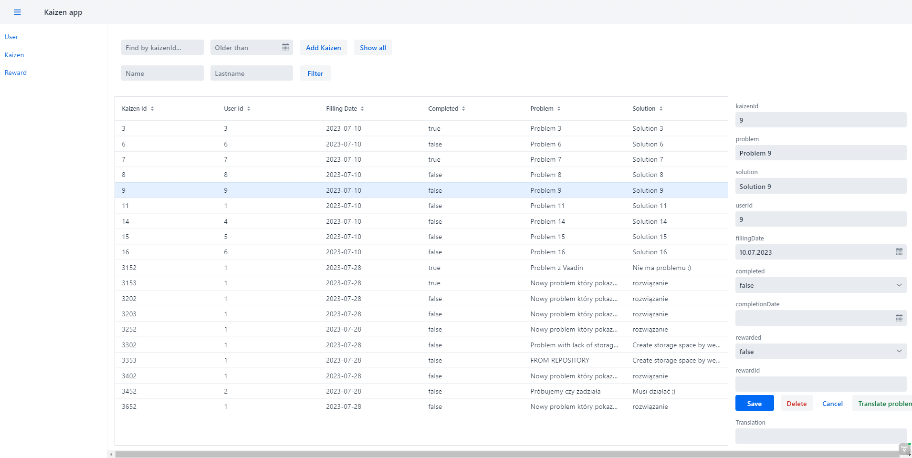

# michal2220_Kaizen_frontend

Kaizen Management System - Frontend

The Kaizen Management System Frontend is a web-based user interface developed using the Vaadin framework. It provides an intuitive and user-friendly platform for managing kaizens, rewards, and user data within an organization. The frontend seamlessly interacts with the backend, which is built using Java and the Spring Boot framework, facilitating efficient data exchange and real-time updates.

Features
The frontend offers the following key features:

User Management: Users can be added, updated, and removed from the system. The frontend provides an easy-to-use interface to manage user information such as name, last name, and brigade.

Kaizen Management: Users can create, view, update, and delete kaizens. The frontend allows users to track improvement suggestions and their status effectively.

Reward Management: Rewards can be added, edited, and deleted through the frontend. Users can easily manage and allocate rewards to employees based on their contributions.

Translation Support: The application offers translation capabilities, enabling users to translate kaizen problems from Polish to English. This feature aids in global collaboration and understanding across language barriers.

Backend Integration
The frontend is integrated with the backend, which is hosted in a separate repository. The backend is implemented using Java and Spring Boot and is responsible for handling data storage, retrieval, and business logic. It communicates with the frontend using RESTful APIs to ensure seamless data exchange and synchronization.

The backend repository can be accessed at the following link:
https://github.com/michal2220/michal2220_Kaizen

Example snapshots:

User view:

Kaizen view:

